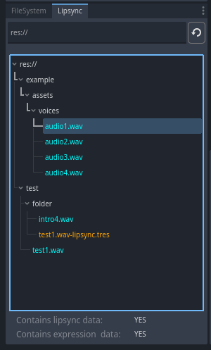
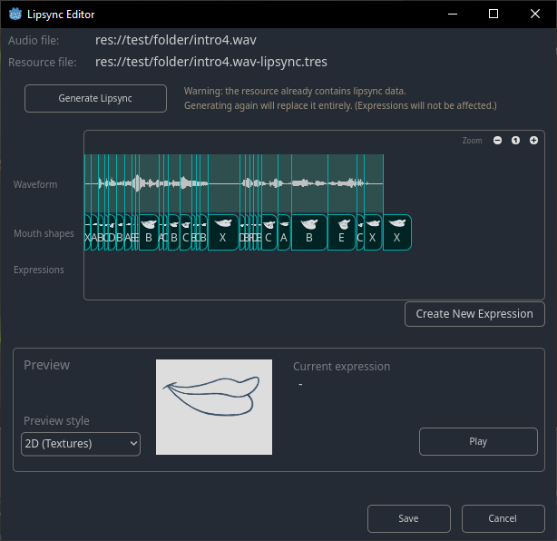
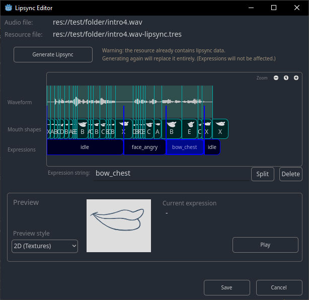

# Baked Lipsync Plugin for Godot
Godot plugin to generate and play lip animation in sync with pre-recorded audio

----

_Baked Lipsync_ is a Godot plugin which uses [Rhubarb](https://github.com/DanielSWolf/rhubarb-lip-sync) under the hood to generate mouth shape data in time with your audio, so you can animate talking characters. 

It adds a tool in the editor to bake animation data from audio files, and when running the game, a special node emits signals every time you need to change the mouth shape. All you have to do is use that signal to change the mouth shape of your characters. (Both 2D and 3D examples provided.)

----

### How to Use

The plugin adds a second file browser panel, which only shows `wav` files (color coded so you know which ones have baked data already):

Double-clicking a file opens the lipsync editor, where you can generate the data by just clicking a button. _You do not have to do anything yourself, all mouth shapes are identified automatically._ After generating, you can visualize it, and play the audio to see a test using a default mouth image.

In your game, instead of playing the audio file, you play the generated resource file using a new `AudioStreamPlayerLipsync` node (also `AudioStreamPlayerLipsync2D` and `AudioStreamPlayerLipsync3D` are included). This will play the audio while emitting the signals for mouth shapes (and optionally expressions, as below).

#### Expressions

Optionally, you can manually add expressions, which are strings emitted at specific times. A separate signal is emitted at the corresponding times, and you can do whatever you want with them (swap faces, animate body, blend shapes, trigger parallel animations or animation tree states, or anything you want).

----

### Rhubarb

Do notice this plugin uses [Rhubarb](https://github.com/DanielSWolf/rhubarb-lip-sync) to decode the audio and identify the mouth shapes. When activating the plugin for the first time, it will automatically download and extract rhubarb in the addons folder, with a `.gdignore` file so it won't be included in the exported game.

----

### Example

Two examples are provided in the `example` folder: one 3D using blend shapes, and one 2D swapping textures.

In the video below, the mouth shapes were generated automatically by the plugin - no manual work was required. Movements for arms and eyes were done using expressions.

https://github.com/user-attachments/assets/e5afc1d4-2710-412b-a876-cdb88d798a73

